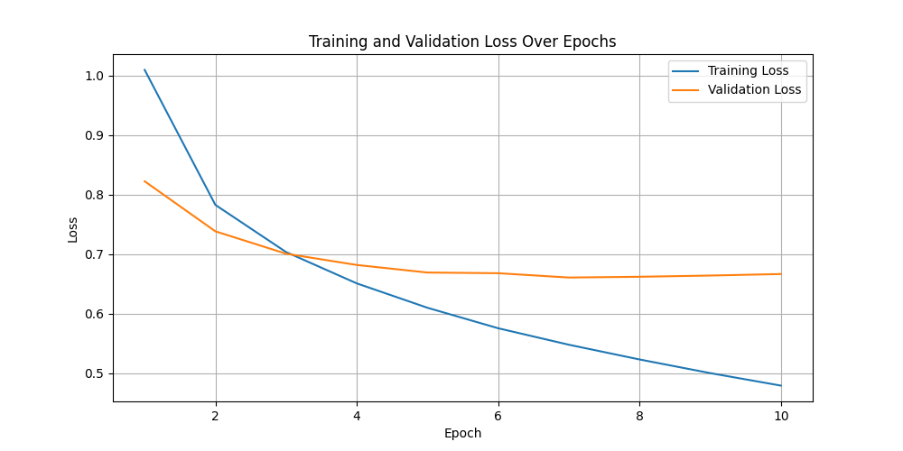

# Transaction Category Prediction System

This project implements a machine learning system that automatically classifies financial transactions into categories based on raw transaction metadata. The system uses a neural network with sentence embeddings for high accuracy.

## Project Structure

```
.
├── data/                      # Data directory
│   ├── ds_project_train_v1.csv  # Training data
│   └── ds_project_test_v1.csv   # Test data
├── embeddings/                # Generated sentence embeddings
├── figures/                   # Generated figures (after running the scripts)
│   ├── loss_plot.png
│   ├── confusion_matrix.png
│   └── shap_force_plot.html
├── models/                    # Saved models (after training)
├── results/                   # Evaluation results (after running the scripts)
│   ├── validation_report.txt
│   └── label_encoder.npy
├── src/                       # Source code
│   ├── train_model.py         # Script to train the model
│   ├── test_model.py          # Script to run tests
│   ├── model_explainability.py # Script for model explainability analysis
│   ├── data_utils.py          # Data utility functions
│   └── model_utils.py         # Model utility functions
├── predictions.csv            # Generated predictions (after running the scripts)
├── requirements.txt           # Python dependencies
└── README.md                  # This file
```

## Setup

1. Create a virtual environment and install dependencies:

```bash
python3 -m venv venv
source venv/bin/activate  # On Windows: venv\Scripts\activate
pip install -r requirements.txt
```

2. Make two folders name `data` and `embeddings`.

3. Copy train and test files (`ds_project_test_v1.csv` and `ds_project_test_v1.csv`) to `data` folder.

## Usage

### 1. Training the Model

To train the model and generate predictions:

```bash
python src/train_model.py
```

This script will:
- Load the training and test data.
- Generate sentence embeddings for transactions using `all-MiniLM-L6-v2`.
- Train a neural network classifier.
- Save the trained model, evaluation report, and test predictions.

### 2. Running Tests

To run the test suite:

```bash
python src/test_model.py
```

This script will:
- Verify the data format.
- Test the embedding generation process.
- Check that a trained model can be loaded correctly.

### 3. Model Explainability Analysis

To analyze feature importance and model explainability:

```bash
python src/model_explainability.py
```

This script will:
- Load the most recently trained model.
- Generate a confusion matrix to visualize performance.
- Use SHAP (`DeepExplainer`) to generate and save a plot explaining a model prediction.

## Model Details

### Feature Engineering
To create a rich input for the model, we concatenate the transaction description text with the transaction amount. This combined string is then fed into the sentence transformer, allowing the model to learn from both the textual and numerical data simultaneously.

### Architecture
The system uses a deep neural network with the following characteristics:
- **Embeddings**: Transaction descriptions are converted into 384-dimensional vectors using the `sentence-transformers` library with the `all-MiniLM-L6-v2` model.
- **Network**: The model is a feed-forward neural network with three fully-connected layers (two hidden layers with 512 neurons each and one output layer). It uses ReLU activation functions and Dropout for regularization.
- **Training**: The model is trained with a batch size of 64 for 10 epochs.

## Evaluation

The model is evaluated using the weighted F1 score, which balances precision and recall across all categories. The training and validation loss are monitored to prevent overfitting.



### Validation Performance

The model achieves a weighted F1 score of **0.78** on the validation set. Here is the detailed classification report:

```
Validation F1 Score (weighted): 0.7847

Classification Report:
                           precision    recall  f1-score   support

                 Benefits       0.61      0.50      0.55        34
                Donations       0.67      0.50      0.57       131
                Education       0.78      0.52      0.62       218
       Financial Services       0.78      0.68      0.73      1369
           Food and Drink       0.79      0.87      0.83     17444
                Groceries       0.77      0.73      0.75      3453
                   Health       0.87      0.78      0.82      2288
    Housing and Utilities       0.76      0.60      0.67      1011
                   Income       0.90      0.85      0.87       876
            Miscellaneous       0.39      0.12      0.18       125
              Obligations       0.61      0.61      0.61       155
               Recreation       0.78      0.72      0.75      2262
                 Shopping       0.72      0.73      0.73     10945
Transfers and Withdrawals       0.81      0.77      0.79      2707
           Transportation       0.87      0.83      0.85      4031
       Travel and Leisure       0.85      0.71      0.78       741

                 accuracy                           0.79     47790
                macro avg       0.75      0.66      0.69     47790
             weighted avg       0.79      0.79      0.78     47790
```

## Deployment Considerations

In a production environment, this system could be deployed as follows:

1. **API Service**: The trained model could be wrapped in a REST API using Flask or FastAPI, allowing other services to send transaction data and receive category predictions.

2. **Batch Processing**: For large volumes of transactions, a batch processing pipeline could be implemented using Apache Airflow or similar tools.

3. **Real-time Processing**: For real-time categorization, the model could be integrated into a streaming pipeline using Kafka or similar technologies.

4. **Monitoring and Retraining**: Implement monitoring to track model performance and set up automated retraining when performance degrades.

5. **Explainability Interface**: Create a dashboard for business users to understand model decisions and feature importance.

## Continuous Improvement

To continuously improve the model:

1. **Data Collection**: Implement a feedback loop to collect corrections from users when categories are incorrectly predicted.

2. **Feature Engineering**: Experiment with different embedding models or combine embeddings with other features.

3. **Model Updates**: Periodically retrain the model with new data to capture evolving transaction patterns.

4. **A/B Testing**: Test model improvements against the current production model before deployment.

## License

[Specify license information here]
